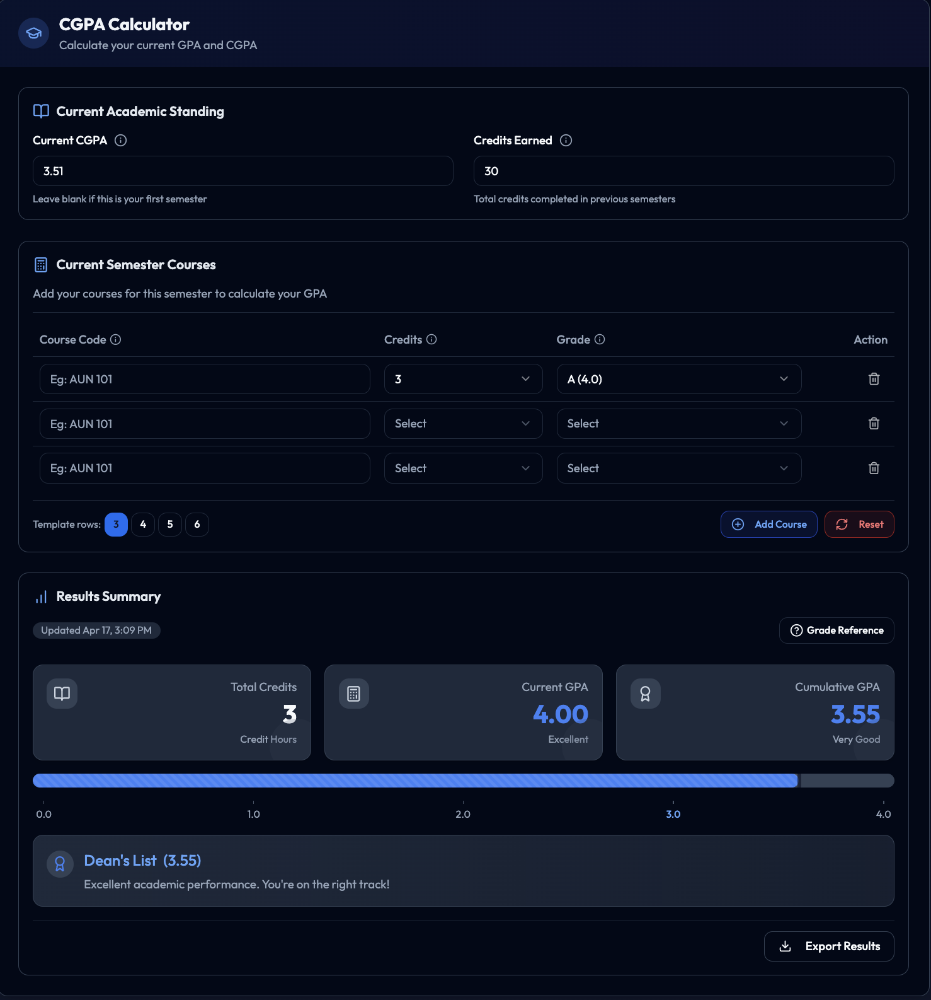
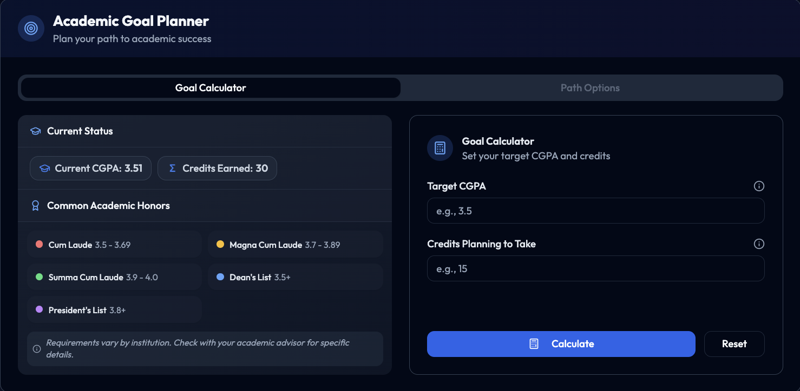

# CGPA Calculator (NextJS Version)

A modern, sophisticated CGPA (Cumulative Grade Point Average) calculator built with NextJS, React, TypeScript, and TailwindCSS.

## Screenshots

### CGPA Calculator



### GPA Goal Planner



## Features

- **Modern UI/UX**: Clean, professional interface with smooth animations and transitions
- **Dual Functionality**:
  - CGPA Calculator for tracking current academic performance
  - GPA Goal Planner for mapping path to academic targets
- **Client-side Processing**: Lightning-fast calculations without server roundtrips
- **Dark/Light Mode**: Automatic theme detection with manual toggle option
- **Responsive Design**: Optimized for all devices from mobile to desktop
- **Accessibility**: Keyboard navigation support and screen reader compatibility
- **Export Functionality**: Save your data as CSV for record keeping
- **Academic Honors Guide**: Reference for common academic distinction requirements

## Tech Stack

- **Framework**: [Next.js 14](https://nextjs.org/) with App Router
- **UI Libraries**:
  - [TailwindCSS](https://tailwindcss.com/) for styling
  - [Shadcn/ui](https://ui.shadcn.com/) for UI components
  - [React Icons](https://react-icons.github.io/react-icons/) for iconography
  - [Framer Motion](https://www.framer.com/motion/) for animations
- **Language**: [TypeScript](https://www.typescriptlang.org/)
- **Forms & Validation**: React Hook Form with Zod
- **State Management**: React Context API with localStorage persistence

## Getting Started

1. Clone the repository
2. Install dependencies:

```bash
pnpm install
```

3. Start the development server:

```bash
pnpm run dev
```

4. Open [http://localhost:3000](http://localhost:3000) in your browser

## Usage

### CGPA Calculator

- Input your current CGPA and credits earned (optional)
- Add courses with their credit hours and grades
- View your calculated CGPA in real-time
- Track your progress toward honors distinctions

### GPA Goal Planner

- Set your current CGPA, credits earned, and target GPA
- The planner will calculate the required GPA for upcoming courses
- Adjust parameters to see different scenarios

## Deployment

This application can be easily deployed to Vercel:

[](https://vercel.com/new/clone?repository-url=https%3A%2F%2Fgithub.com%2FNabsCodes%2Fcgpa_calculator%2Ftree%2Fmain%2Fcgpa-calculator-nextjs)

## Acknowledgements

- Inspired by the original Django version of the CGPA Calculator
- UI/UX redesigned for improved user experience and modern aesthetics
- Built with best practices for React and NextJS applications
